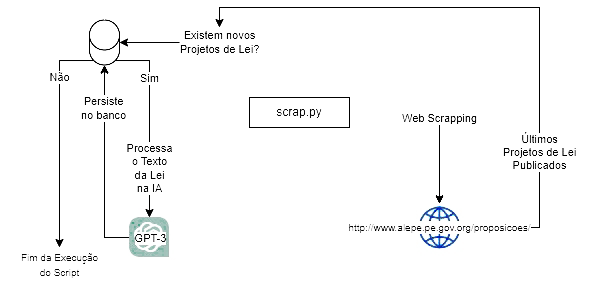
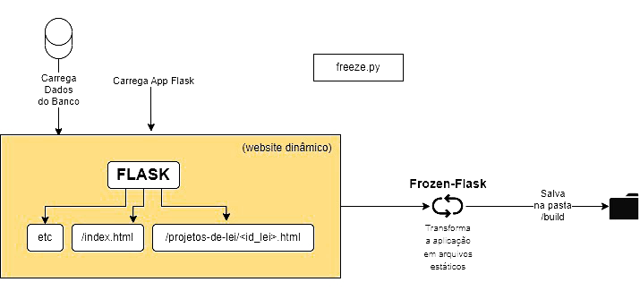
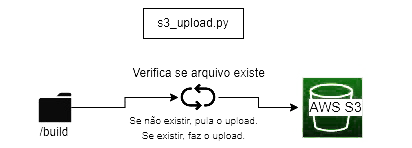

# Projetos de Lei de Pernambuco

## Objetivo

Este projeto visa disponibilizar e facilitar a leitura dos Projetos de Lei publicados pelos deputados do estado de Pernambuco. A iniciativa tem como objetivo promover a participação pública no processo legislativo, permitindo o engajamento dos cidadãos de maneira ágil e eficiente em relação às proposições legislativas.

## Tecnologias Utilizadas

- Python 3.11
- BeautifulSoup4
- MySQL
- Flask
- Frozen-Flask
- GPT-3
- AWS S3

## Arquitetura e Funcionamento
O projeto foi desenvolvido em Python 3.11 utilizando a biblioteca Flask para estruturar o site, a biblioteca Frozen-Flask para construir os arquivos estáticos do site e um Bucket no S3 para hospedar tudo. O funcionamento do projeto se dá da seguinte maneira:

### Scrapping
Executamos o `scrap.py`, um módulo do projeto que acessa o site 'http://www.alepe.pe.gov.br/proposicoes/' e faz o scrapping dos últimos projetos de lei publicados no estado, processando-os com o GPT-3 e, por fim, alimentando nosso banco de dados. 

<details>
  <summary>Fluxo de Funcionamento</summary>
  
  
  
</details>


### Geração de Site Estático
Em seguida, executamos o `freeze.py` que inicia uma instância da nossa aplicação Flask alimentada pelas informações atualizadas no banco de dados e cria uma pasta de `/build` com os arquivos estáticos.

<details>
  <summary>Fluxo de Funcionamento</summary>
  
  
  
</details>

### Upload no Bucker S3
Por fim, executamos o arquivo `s3_upload.py` para fazer o upload de toda a pasta `/build` para um bucket S3, onde nosso site é hospedado de forma estática, com todos os projetos de lei atualizados.

<details>
  <summary>Fluxo de Funcionamento</summary>
  
  
  
</details>

## Como utilizar

### Instalação

1. Clone o repositório:
```
git clone https://github.com/seu_usuario/projetos-de-lei-pe.git
```

2. Crie um arquivo `.env` com as variáveis de ambiente necessárias.

3. Instale as dependências:
```
pip install -r requirements.txt
```

### Execução

1. Rode o módulo `scrap.py` para obter os últimos projetos de lei publicados no estado.
```
python scrap.py
```

2. Execute o `freeze.py` para iniciar a aplicação Flask e gerar os arquivos .html.
```
python freeze.py
```

3. Faça o upload da pasta build para o bucket S3 utilizando o arquivo `s3_upload.py`. Não esqueça de passar a pasta `/build` como parâmetro de argumento.
```
python s3_upload.py app/build/
```

## Contribuição
Este projeto é uma iniciativa aberta e acolhe contribuições de todos os interessados em colaborar. Se você tiver ideias sobre como melhorar o projeto, abra uma issue para discussão ou envie um pull request com suas alterações. Sua contribuição pode ser desde corrigir um erro de digitação até propor novas funcionalidades ou melhorias de desempenho.

Agradecemos desde já sua contribuição!

## Licença
Este projeto é licenciado sob a Licença MIT, uma licença de código aberto permissiva que permite que você use, copie, modifique e distribua o software sem restrições. Esta licença também inclui uma cláusula de não responsabilidade, isentando o autor e os colaboradores de qualquer responsabilidade por danos ou outros problemas relacionados ao uso do software.

Ao utilizar este projeto, você concorda com os termos da Licença MIT. Para ler a [LICENSE](LICENSE) completa, consulte o arquivo LICENSE incluído neste repositório.
